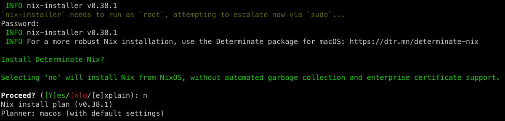

<div align="center">

# Danno's Universal System & VM Manager (Powered by Nix); Alpha Test on MacOS

[Install](#os-x-instillation) • [Documentation](./docs/index.org)


</div>

---

### Table of Contents
- [Introduction](#introduction)
- [Features](#features)
- [OS X Instilation](#os-x-instillation)
- [Build and Run NixOS VMs](#build-and-run-nixos-vms)
- [Building Blocks](#building-blocks)

# Introduction

Yoinked & Twisted from: https://github.com/mrkuz/macos-config

- I found the repo from this post: https://www.reddit.com/r/NixOS/comments/1be4j7d/experiments_with_qemu_nixos_vms_on_macos/

> ✅ Tested on OS X
> - [ ] TODO: Fork to a Universal System & VM Manager by merging with my systemd wrapped qemu process Arch Linux script. Test in these systemd distros: Debian (Also test in Ubuntu & PopOS), Arch & NixOS.
> - [ ] TODO: Add support for [skarnet](https://skarnet.org/software/)'s [`s6`](https://skarnet.org/software/s6/) init system. Test in Artix (with s6 init) and [sixOS](https://codeberg.org/amjoseph/sixos).
> - [ ] TODO: If you're feeling particularly masochistic, add support for [NixBSD](https://github.com/nixos-bsd/nixbsd) & MinGW/Windows.
> - [ ] Also consider managing the Mac Classic emulators, SheepShaver & Basilisk.

<div align="center">
<p>
  <strong><em>
  Welcome to my System & Virtual Machine Manager built declaritively through Nix.
  </em></strong>
</p>
</div>

Manage your system configuration & qemu vms using nix ([nix-darwin](https://github.com/LnL7/nix-darwin) if OSX) with [flakes](https://nix.dev/concepts/flakes.html).

There are 2 branches:

| Name       | System              | Description                                                                        |
|------------|---------------------|------------------------------------------------------------------------------------|
| mini       | darwin              | Minimal configuration including linux-builder                                      |
| chonk      | darwin              | For Casual Scrubs 2 Copy My Shit                                      |

*You are are currently on the **mini** branch*

The main purpose of the mini branch is to provide the virtual machine manager.

A secondary purpose is to get the nix system config scaffolding up & running. That way, you can build your own config. 

# Features:

- Install and configure software packages via [nix](https://nix.dev)
- Build and run [NixOS](https://nixos.org) virtual machines using [QEMU](https://www.qemu.org) (see [here](#build-and-run-vms))
  + Good for isolated dev environments
- Manage [Homebrew](https://brew.sh) installations via [nix-homebrew](https://github.com/zhaofengli/nix-homebrew)
- Use [Home Manager](https://github.com/nix-community/home-manager) instead of plain dotfiles. TODO: Migrate to GNU stow

Notes:
- Not everything is installed via nix. I use following guideline:
    1. If it is offical Apple software or there are no other options -> App Store (using [mas](https://github.com/mas-cli/mas))
    2. If it is proprietary software or distributed as DMG -> [Homebrew](https://brew.sh)
        - I also added a cmd to migrate stuff from a previous install 
    3. Else -> nix
    4. Exception: Some tools for development -> [mise](https://mise.jdx.dev)
- [Homebrew Bundle](https://github.com/Homebrew/homebrew-bundle) keeps track of software installed via App Store or Homebrew
- [ ] TODO: add doom eMacs config
- [ ] TODO: consider creating a shell script installer. Maybe even a flake for embedding music into the script, keygen style.

# OS X Instillation

1. Install Nix using the [Determinate Nix Installer](https://github.com/DeterminateSystems/nix-installer?tab=readme-ov-file#determinate-nix-installer)

```shell
curl --proto '=https' --tlsv1.2 -sSf -L https://install.determinate.systems/nix | sh -s -- install
```

NOTE: Say no to installing determinate, install vanila nix from nix.com; Just use as an install script. 

For some reason, nix-darwin doesn't like determinate nix. Don't know why (I think it got botched on an update, it used to work) 



2. Clone repo

```shell
nix shell nixpkgs#git
git clone https://github.com/itsHyaci/univ-SYSandVMManager
cd univ-SYSandVMManager
```

3. Install nix-darwin

If you just want the Virtual Machine Manager, run this cmd:
```shell
sudo nix --extra-experimental-features "nix-command flakes" run nix-darwin/master#darwin-rebuild -- switch --flake .#bootstrap
```

- [ ] TODO: edit config as to not necessitate appending this to nix: 
`--extra-experimental-features "nix-command flakes"`

If you also want to copy my shit you casual scrub, then run this cmd next:
```shell
echo LOL not released yet, I\'m migrating my dotfiles to GNU stow
```

- [ ] TODO: add OS X system managment scripts


<a id="build-and-run-vms"></a>

# Build and Run NixOS VMs

To build Linux packages on MacOS, you need a [remote Linux builder](https://nixos.org/manual/nixpkgs/stable/#sec-darwin-builder). Thankfully this can be archived with one line in nix-darwin:

```nix
nix.linux-builder.enable = true;
```

P.S. Enabling the linux builder is the one job bootstrap.nix .

The builder is setup to start automatically. If you dislike this, add following:

```nix
launchd.daemons.linux-builder.serviceConfig = {
  KeepAlive = lib.mkForce false;
  RunAtLoad = lib.mkForce false;
};
```

You then need to start the builder manually:

```shell
sudo launchctl start org.nixos.linux-builder
```

you can confirm if the builder is running with this cmd:
```shell
sudo launchctl list org.nixos.linux-builder
```

After the builder is up and running, you can launch every VM defined in `hosts/nixos/vm/` with a single command. For instance:

```shell
nix --extra-experimental-features "nix-command flakes" run .#playground-vm
```

In case you run into [issues](https://github.com/NixOS/nix/issues/4119) with [sandboxed](https://nixos.org/manual/nix/stable/command-ref/conf-file.html#conf-sandbox) builds, you can disable the sandbox temporary with `--option sandbox false`.

Use cases: Run docker, isolate applications, ... TODO: document use cases.

To learn how to add additional VMs, check out [flake.nix](flake.nix) (look for `mkVm`).

VMs can also be build out-of-tree, see this [example](examples/darwin/nixos-vm).

The QEMU package provided and used by this configuration comes with support for hardware accelerated graphics, based on the awesome work of [Akihiko Odaki](https://gist.github.com/akihikodaki/87df4149e7ca87f18dc56807ec5a1bc5).

The '[qemuGuest](#qemu-guest)' module provides a bunch of useful configuration options for QEMU guests.

# Building Blocks

P.S. If you need to edit your vm,module,etc run this before re-cloning & rebuilding:

```shell
sudo nix --extra-experimental-features "nix-command flakes" store gc --keep-outputs
```

<a id="vms"></a>

## VMs

List of individual VM's that could be spun up:

| Name       | System          | Description                                                                        |
|------------|-----------------|------------------------------------------------------------------------------------|
| docker     | nixos (console) | Runs [Docker Engine](https://docs.docker.com/engine/)                              |
| firefox    | nixos (graphic) | Runs [Firefox Developer Edition](https://www.mozilla.org/en-US/firefox/developer/) |
| gnome      | nixos (graphic) | Latest [GNOME desktop environment](https://www.gnome.org) (without apps)           |
| k3s        | nixos (console) | Runs [k3s](https://k3s.io)                                                         |
| playground | nixos (console) | NixOS playground to fiddle around                                                  |
| toolbox    | nixos (graphic) | VM with some tools preconfigured                                                   |
| snapd      | nixos (console) | Runs [snapd](https://snapcraft.io/docs/get-started)                                |

### VUH

- [ ] TODO: Also in './vms/', add flake for the VUH-web-stack (A Virtual Machine img w/ C, D & Haskell Unikernel + Haskell Backend & Front-end-Scaffolding)
